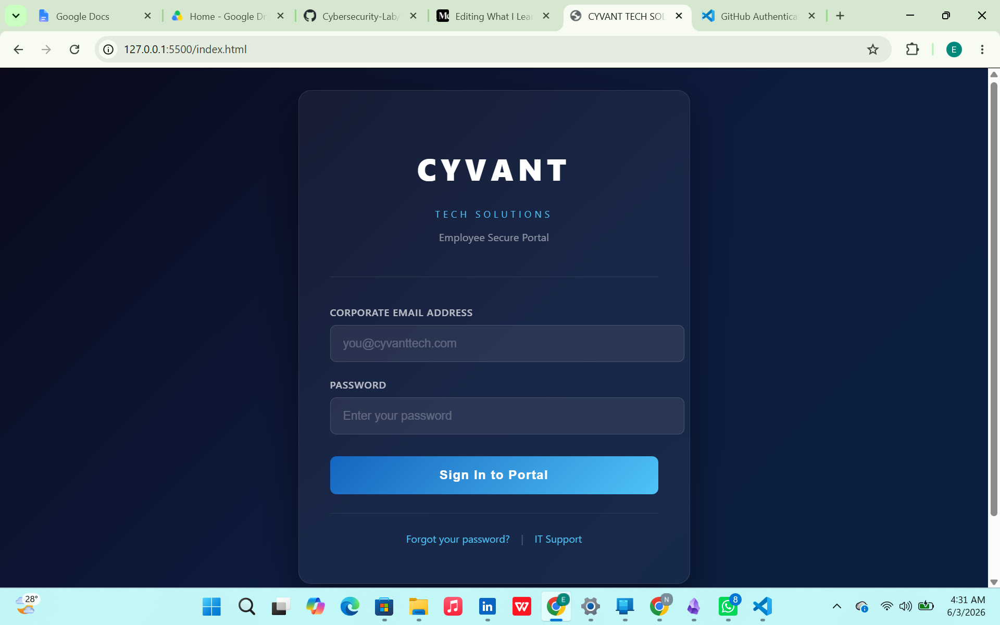
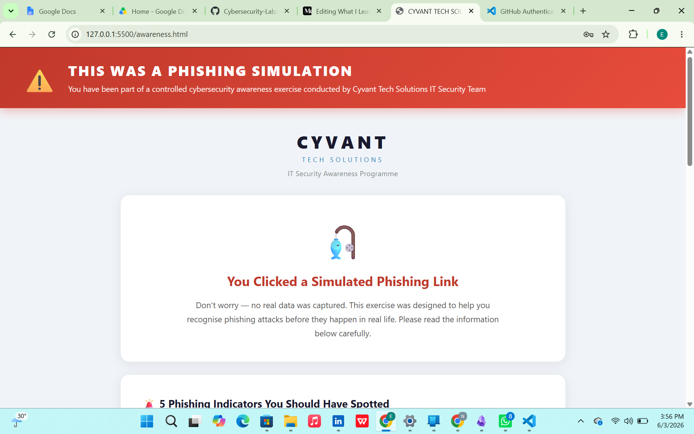
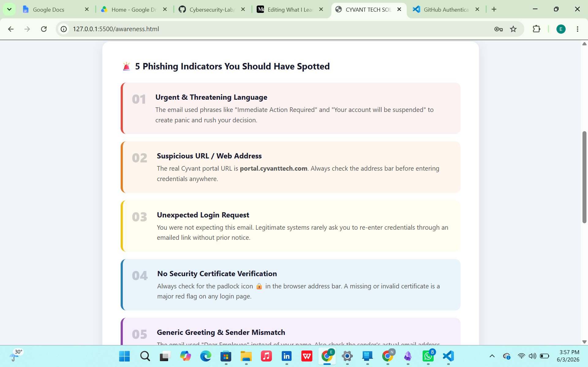
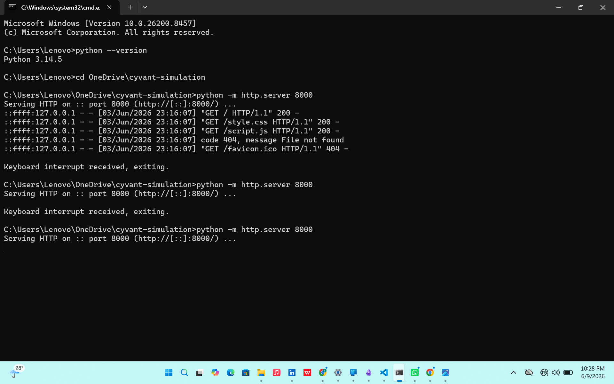

# CYVANT Phishing Awareness Simulation Platform

# Project Overview

This project was developed as part of a university cybersecurity assignment focused on phishing awareness and user security education.

The platform simulates a phishing scenario using a fictional company called CYVANT TECH SOLUTIONS. Users interact with a realistic login portal before being redirected to an educational awareness page that explains the phishing indicators they should have identified.

The goal of the project is to demonstrate how phishing attacks work while immediately converting that experience into a learning opportunity.

### Features

* Simulated corporate login portal
* Phishing awareness landing page
* Interactive cybersecurity training quiz
* Client-side activity logging
* Educational phishing indicator breakdown
* User awareness and reporting guidance

# Tech Stack

### Frontend

* HTML5
* CSS3
* JavaScript

### Deployment

* Python HTTP Server
* Ngrok (for temporary public access and controlled testing)
  
### User Flow

1. User accesses the login portal.
2. User enters credentials into the simulation form.
3. JavaScript intercepts the submission.
4. Simulated activity is logged locally.
5. User is redirected to the awareness page.
6. User reviews phishing indicators and reporting guidance.
7. User completes the cybersecurity training quiz.

### Learning Outcomes

Through this project I gained hands-on experience with:

* Frontend web development
* Form handling and validation
* JavaScript event listeners
* DOM (Document Object Model) manipulation
* Local web hosting
* Security awareness training concepts
* Project documentation

### Ethical Compliance

This project was developed strictly for educational purposes. No credentials were stored, transmitted, or collected. All logging functionality was limited to local browser-based simulation metrics.
The objective of the project is security awareness training and cybersecurity education.

## Screenshots

### Login Portal

### Awareness Page

### Cybersecurity

### Deployment

